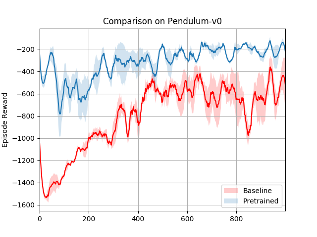
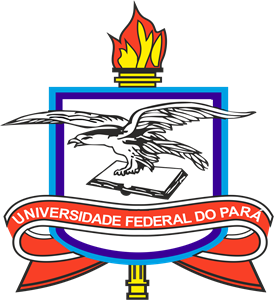

# PRECON: Pre-training with Continuous Actions

This package does pre-training in continuous environments using models
of stable baselines. As the day of this commit :), stable baselines has a
implementation of pre-training only for environments with discrete actions.

## Implementations

- [x] A2C
- [ ] SAC
- [ ] TD3
- [ ] PPO

The pre-training is made by Behavioral Cloning [1], where a neural network is 
trained on a supervised fashion to map from environment states to actions. This
network is then used as the initial policy of the A2C algorithm.

[1]: [ALVINN: AN AUTONOMOUS LAND VEHICLE IN A NEURAL NETWORK](https://papers.nips.cc/paper/95-alvinn-an-autonomous-land-vehicle-in-a-neural-network.pdf)

## Comparison of baseline and (pretrained + normal training)

The comparison was made on the Pendulum environment, details and implementation 
are on ```precon/examples/a2c_comparison.py```. We can see that, on average, the
use of pre-training improves performance.




## Prerequisites

* Python 3.6.7+

Install required packages by:

```bash
pip install -r requirements.txt
```

## Usage

You need to perform all the steps below

* Make an expert agent
    * You need to implement the ExpertAgent interface
* Make data (states and actions) from enviroment episodes
* Run the pre-training

### Example

See more examples on ```precon/examples/```
```python
num_steps = 2*10**6  # 10**3
num_epochs = 1000
env = gym.make('Pendulum-v0')

### Expert Agent ###
# You can do anything on the predict function, just implement the interface :)

class ExpertPendulum(ExpertAgent):

    def __init__(self, model: BaseRLModel):
        self.model = model

    def predict(self, observation: np.ndarray) -> np.ndarray:
        return self.model.predict(observation)


n_actions = env.action_space.shape[-1]
param_noise = None
action_noise = OrnsteinUhlenbeckActionNoise(mean=np.zeros(n_actions),
                                            sigma=float(0.1) * np.ones(n_actions))

model = DDPG("MlpPolicy", env, verbose=1, param_noise=param_noise,
             action_noise=action_noise, memory_limit=5*10**4)
model.learn(total_timesteps=num_steps)


expert_agent = ExpertPendulum(model)

### Make Data ###
data = generate_expert_dataset(expert_agent, env, num_steps)

### Pre-Training ###
pre_trained_model = A2C("MlpPolicy", "Pendulum-v0")
pretrain = Pretrain(pre_trained_model, data['states'], data['actions'])
pretrain.fit(num_epochs=num_epochs)
pre_trained_model = pretrain.get_pretrained_model()

### Continue Learning ###
model.learn(total_timesteps=num_steps)
```

## License

This project is licensed under the MIT License - see the [LICENSE](https://github.com/CoffeeOverflow/DrawToCode/blob/master/LICENSE) file 
for details.

[](https://portal.ufpa.br/ "Visite o site da UFPA")
